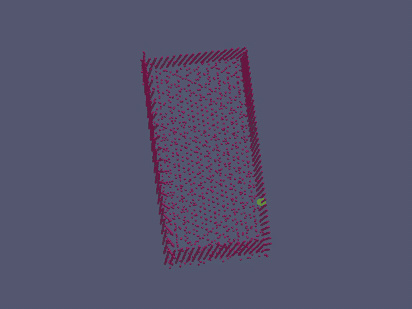
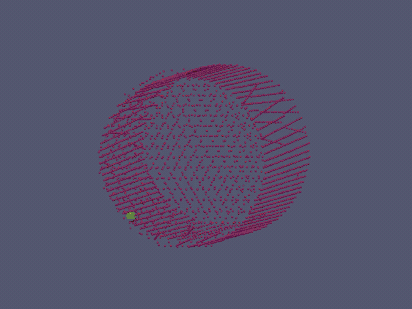

<h1 align="center">Explorable Grasp Detection (EGD) for Two-Finger Robot Handover</h1>

[PDF](https://arxiv.org/abs/)&nbsp;&nbsp;•&nbsp;&nbsp; [Videos](https://www.youtube.com/)&nbsp;&nbsp;•&nbsp;&nbsp; **ICEE 2024**

## Overview
The Explorable Grasp Detection (EGD) project enhances robotic grasp pose detection using point cloud data, targeting two-finger grippers. 
It employs exploration and exploitation strategies to efficiently identify optimal grasping regions.

Let's look at algorithm process for some primitive shapes:
<div align="center">
<table>
  <tr>
    <td align="center"><b>Cube</b></td>
    <td align="center"><b>Cylinder</b></td>
  </tr>
  <tr>
    <td></td>
    <td></td>
  </tr>
</table>
</div>

## Requirements
- [CoppeliaSim Robotics Simulator](https://www.coppeliarobotics.com/) (v4.6.0 (rev. 18) recommended)

## Installation
Clone the repository and install required Python packages:
```
git clone https://github.com/TaarLab/EGD.git
cd EGD
pip install -r requirements.txt
```

## Algorithm Implementation
The core algorithm is implemented under the `src` directory. To understand and engage with the algorithm navigate to the `src` directory and checkout `egd_2dof.py`.

### Testing and Visualization
To test and visualize the grasp detection, use the provided script that processes a sample point cloud from the `samples` folder:

```bash
python test_visualization.py
```
This script demonstrates how the algorithm interprets input data and visualizes the results.


## Usage
The EGD project includes several components designed for specific tasks within the grasp detection process:

### Simulation Environment Setup and Grasp Detection
Sets up the simulation environment, captures point clouds from vision sensors, and performs grasp detection. This process integrates with robotic simulation platforms to evaluate grasps in real-time using inverse kinematics and visual processing.
```
python grasp/grasp.py
```
**Requirements:** Simulation environment with UR5 robot model and RG2 gripper configured in CoppeliaSim.

### Enhanced Grasp Detection with Collision Detection
Offers an advanced detection process that includes collision detection and pose adjustments based on dynamic simulation outcomes, optimizing for accuracy and error handling.
```
python grasp/grasp_v2.py
```
**Requirements:** An object directory is necessary for loading different meshes, with the simulation environment configured similarly to the basic grasp detection setup.

### Dataset Generation
Manages the importation and preprocessing of 3D object files into the simulation, preparing point clouds for the detection model.
```
python grasp/import.py
```
**Requirements:** Ensure the paths to object and dataset directories contain the necessary 3D model files and grasp data.

### Performance Evaluation
Benchmarks various configurations of the grasp detection algorithm, dynamically adjusting hyperparameters and logging results for analysis.
```
python grasp/performance.py
```
**Requirements:** Simulation environment with UR5 robot model and RG2 gripper configured in CoppeliaSim.

## Configuration
To configure the hyperparameters for the fitting process, adjust the settings in the fitting function call within the scripts as shown below:

```python
await fit(FitParameters(
    graph=graph,
    points=point_cloud,
    grasp_errors=grasp_errors,
    hyper_parameters=HyperParameters(
        steps=50,
        sample_size=20,
        min_error=-20.0,
        acceptable_error=-0.25,
        min_exploration_error=-20.0,
        max_exploitation_error=-0.05,
        max_gripper_opening=0.085,
        min_gripper_opening=0.01,
        current_gripper_z_angle=0,
    )
))
```
These parameters control various aspects of the grasp detection process, including the number of iterations, sample size per iteration, and thresholds for acceptable errors.

## License

Distributed under the MIT License. See `LICENSE` for more information.